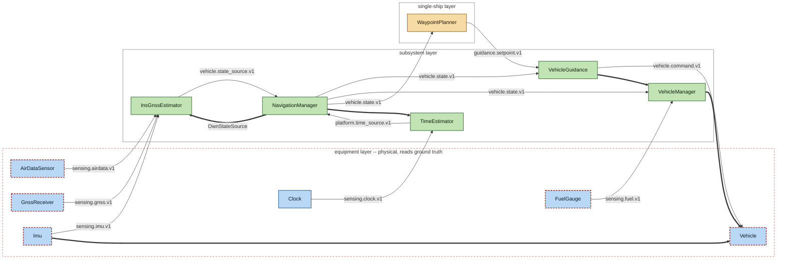

# Architecture

Status: draft

## Shape

```
              +------------------------------------+
              |         Multi-ship layer           |   cyber
              |  objectives, coordination, tasking |
              +------------------------------------+
                              |
              +------------------------------------+
              |        Single-ship layer           |   cyber
              |   tracker, SA, action planner      |
              +------------------------------------+
                              |
              +------------------------------------+
              |         Subsystem layer            |   cyber
              |  vehicle, sensor, effector systems |
              +------------------------------------+
- - - - - - - - - - - - - - - | - - - - - - - - - - - -  truth boundary
              +------------------------------------+
              |          Equipment layer            |   physical
              | vehicle, sensors, comms, effectors |
              +------------------------------------+
                              |
     +--------------------------------------------------+
     |        Simulation core -- ground truth            |
     |  clock, kinematics, detection, engagement         |
     +--------------------------------------------------+
```

## Implemented topology

The shape above is the intended architecture. This is what is actually wired,
derived from the source rather than drawn: components, the layer each lives in,
and the interfaces connecting them. It is regenerated by

```bash
python tools/generate_architecture_diagram.py
```

and `pytest` fails while it is stale, so it cannot drift from the code. See ADR
0020.

<!-- generated: topology -->


Published with no consumer: `platform.time.v1` (NavigationManager), `vehicle.mass.v1` (VehicleManager), `planning.action.v1` (WaypointPlanner).
<!-- end generated: topology -->

Reading it. A plain arrow is a **publication**, labelled with the interface
carried, and it points the way the data goes. A thick arrow is a
**composition**: a component holding a reference to one below it whose type is
a concrete class rather than a port.

The distinction is doing real work. A constructor parameter typed by a
*protocol* is a declared port, so what the provider publishes crosses it and is
drawn as a publication — which is how a navigation source reaches the manager.
A parameter typed by a *concrete class* is a component reaching into one
implementation, and claiming a publication there would invent one:
`VehicleGuidance` holds a `VehicleManager` and calls `capability_bound()` on
it, but never receives a `MassEstimate`. See ADR 0021.

Where a port has several providers they are alternatives — a platform composes
one — and the diagram draws a single node named for the port. `Vehicle` is the
one such node today, standing for both vehicle models (ADR 0023). The equipment layer is drawn with a dashed border because it is
the truth boundary: components inside it with a dashed outline are the ones that
actually read ground truth, and no component above the boundary may. The tool
enforces that itself and exits non-zero if a truth reader appears in a cyber
layer, so the picture and the invariant cannot disagree.

Layers with no components do not appear. The multi-ship layer and the simulation
core are absent because neither exists yet, which is the difference between this
diagram and the drawing above it.

Two things the derivation cannot see, stated here because a silent gap in a
generated picture is worse than an admitted one:

- **`FuelGauge`'s dependency on the vehicle.** It arrives as `mass_dry_kg:
  float`, and no signature carries where that float came from. Inferring it from
  a parameter name would invent edges, so the diagram understates the coupling
  and counts the omission instead.
- **`Clock`'s truth read.** Every other sensor takes a `true_`-prefixed
  argument. A clock's truth input is the elapsed interval `dt_s`, deliberately
  unprefixed because for a clock the interval *is* the corrupted quantity — so
  `Clock` reads truth and is not marked as doing so.
- **Which vehicle model a platform composes.** The `Vehicle` node stands for
  both, and which one is in a given scenario is a composition decision the
  architecture does not make.

An interface published with nothing consuming it is listed beneath the diagram
rather than drawn with a dangling arrow. That list is informative in its own
right: it says which products of this system nothing yet asks for.

## Principles

**Composition is declarative.** A YAML specification is the single source of
truth. The GUI edits it, the scenario builder generates it, Monte Carlo
transforms it, a lab is one with stubs substituted. Nothing in the toolchain
holds state that is not expressible in it. See `40-composition-spec.md`.

**Code declares shape; data supplies values.** Component logic is Python (ADR
0002); parameter values are data, authored in YAML -- the capability
descriptor for defaults and bounds shipped with the component, the
composition spec for what a specific scenario overrides them to. See
`40-composition-spec.md` §4. The registry, the binder, and the descriptor
validator do not exist yet, so today every component's Python dataclass
defaults (`VehicleParameters`, `ImuParameters`, ...) stand in as that data;
`reference_fighter()`-style helpers are test and demo fixtures, not evidence
that a real configuration belongs in source. The moment a value needs to
differ per scenario rather than per component type, it belongs in a
descriptor or a spec, not in a Python default.

**Service orientation as a pattern, not a deployment.** Components register
against a typed in-process registry and are resolved synchronously. Network
transports, brokers, and runtime discovery are excluded: they introduce
nondeterminism, which destroys reproducible Monte Carlo, debuggability, and a
sane fixed-step clock. The registry interface is designed so a remote transport
could be slotted behind it later, and no component may assume in-process
semantics -- no reaching into another component's internals, no shared mutable
state, everything through declared ports.

**Binding happens once, at composition time, then freezes.** Load, discover,
match capabilities against requirements, validate, bind, freeze, run. Continuous
runtime discovery would make a scenario's topology depend on execution order and
would surface mis-wiring mid-run rather than at load. Composition-time validation
is also what lets the GUI grey out pieces that do not fit.

**Interfaces are a package containing no implementations.** Components depend on
`ose.interfaces`; no component depends on another component.

**Only the equipment layer reads truth.** Enforced by port type at import time.
See ADR 0008.

## Current state

Implemented: the baseline vehicle model; three equipment-layer navigation
sensors (`Imu`, `GnssReceiver`, `AirDataSensor`); the subsystem-layer
`InsGnssEstimator`, an
error-state Kalman filter fed by the sensors' published measurements (ADR
0009), published to the rest of the platform through a subsystem-layer
`NavigationManager` -- one own-state publisher per platform, which selects a
source but deliberately does not fuse alternatives (ADR 0014); a equipment-layer
`Clock`; the subsystem-layer `TimeEstimator`, a
dead-reckoning-only estimator of the platform clock's offset and drift, with
no correction source yet (ADR 0010); and the subsystem-layer
`VehicleGuidance`, a heading/speed-hold controller that enforces the
vehicle's admissible sets before publishing a command, the first real
consumer of `PlanarPointMass.project_command()` and the first real producer of
`vehicle.command.v1` (ADR 0011).

Every equipment-layer component answers `capability()`, a self-assessment of
what it can currently achieve, checked by tests that integrate the dynamics
forward and confirm it delivers what it claimed (ADR 0012). `VehicleGuidance`
both consumes capability -- feedforwarding thrust for the turn the vehicle can
actually fly rather than the one its error term asked for -- and publishes one
of its own, composed from the vehicle's envelope and the navigation covariance
it steers on (ADR 0013). Neither estimator publishes a capability; nothing asks
them for one.

`NavigationManager` is the platform's single publisher of both its state and
its time -- position, navigation and timing from one component (ADR 0022). The
two estimators beneath it publish on their own source ports, which is what
makes "one publisher per platform" checkable rather than merely stated (ADR
0021). Nothing consumes `platform.time.v1` yet; the generated block above lists
that alongside `vehicle.mass.v1` and `planning.action.v1`, derived rather than
remembered.

The first single-ship component exists: `WaypointPlanner`, publishing
`planning.action.v1` as an `ActionSet` bundle with one field per subsystem,
so a planner that later decides motion and sensing together can publish
through the same record. It steers at waypoints and converts position to a
heading command, which is why guidance never needed a waypoint setpoint --
the planner decides where, guidance decides how.

Not yet implemented: the registry, the binder, the descriptor validator, the
simulation core itself, and every component type other than vehicle,
navigation, the platform clock, the fuel gauge, the vehicle manager, vehicle
guidance, and the action planner. The composition specification describes
the intended format; nothing consumes it yet.

## Repository layout

```
src/ose/interfaces.py        contracts only, and the interface catalogue
src/ose/frames.py            rotation utilities, no dependencies
src/ose/integration.py       integrators, external to components (ADR 0004)
src/ose/environment.py       environmental parameters (g, rho), no dependencies
src/ose/topology.py          layer and truth vocabulary, names only
src/ose/equipment/           equipment-layer components
src/ose/subsystem/           subsystem-layer components
src/ose/single_ship/         single-ship-layer components
src/ose/composition/         composition-time load checks
docs/                        scope, concepts, architecture, interfaces
docs/adr/                    architecture decision records
docs/models/                 per-model reference, and the modelling documents
                             the code was derived from
prefs/                       shared colours for diagrams and plots
tools/                       generators and checkers, run by hand and by pytest
demos/                       runnable demonstrations
tests/                       pinning and consistency tests
```

`multi_ship/` is added as a sibling of `equipment/` when it acquires its first
component; `single_ship/` arrived that way with `WaypointPlanner`.
`ose/topology.py` already names it, so nothing needs changing when it appears.
